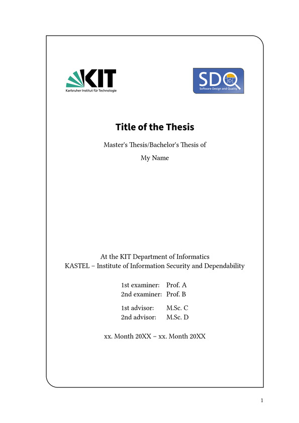
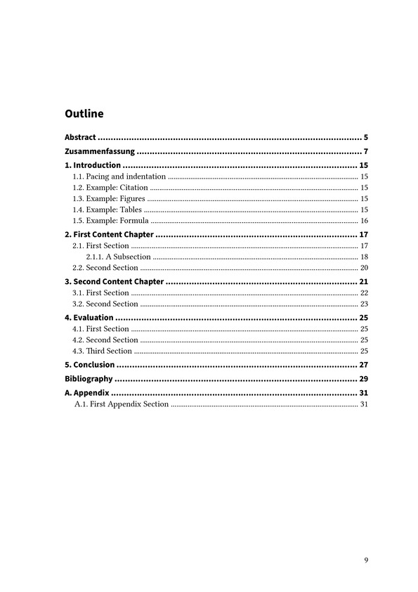
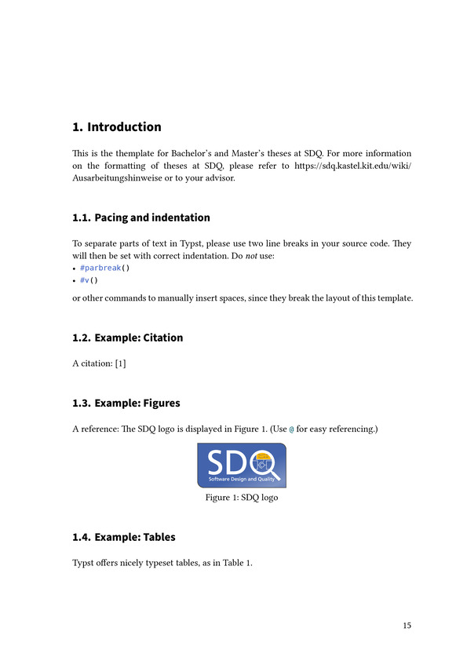
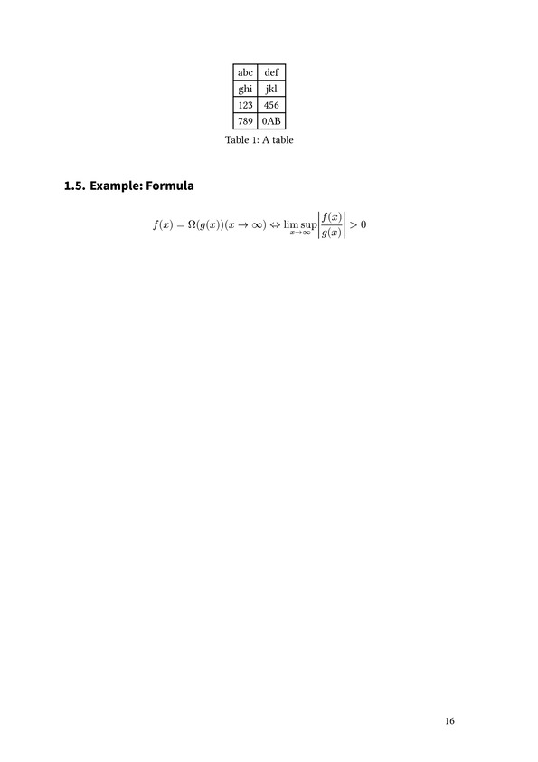
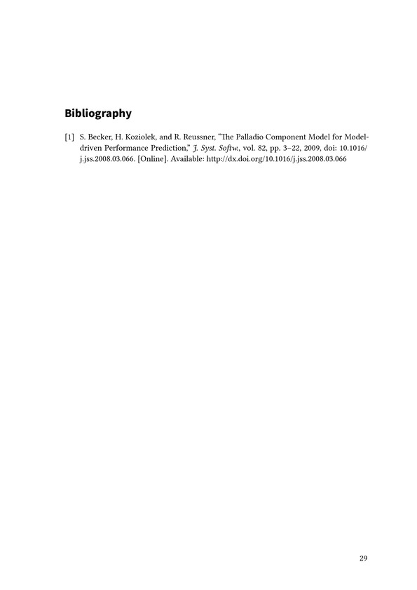
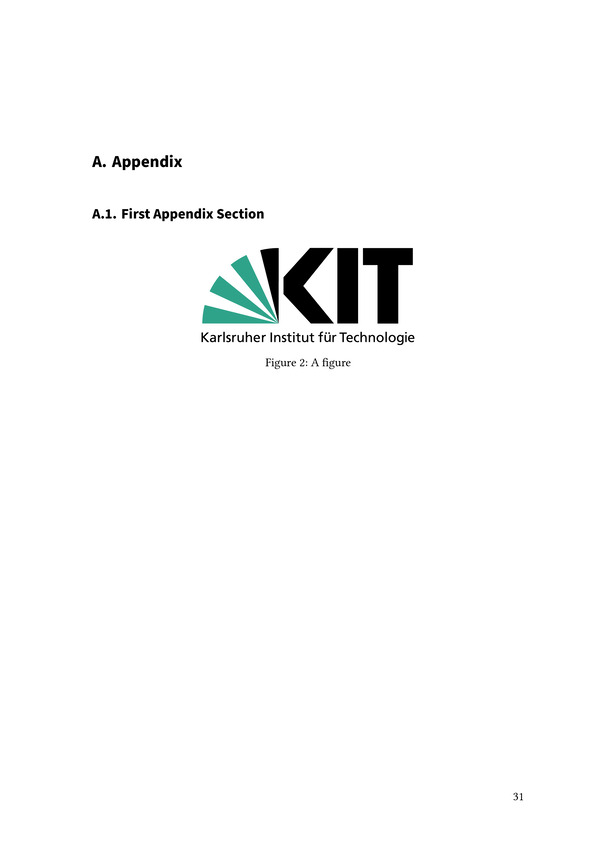

# typst-kit-thesis-template
A template for creating Master and Bachelor theses for students.
This projects tries to be close to the [original LaTeX version](https://www.overleaf.com/read/mvnctgvbnsrf).
However this is not an official template and this project is not affiliated with the KIT.
This template is not guaranteed to comply with the current KIT guidelines.

## Preview ([PDF version](https://raw.githubusercontent.com/wiki/Sematre/typst-kit-thesis-template/main.pdf))

| Title page                                                                                                   | Outline                                                                                                       |
|--------------------------------------------------------------------------------------------------------------|---------------------------------------------------------------------------------------------------------------|
|          |                 |
| Content                                                                                                      |                                                                                                               |
|  |  |
| Bibliography                                                                                                 | Appendix                                                                                                      |
|      |               |
